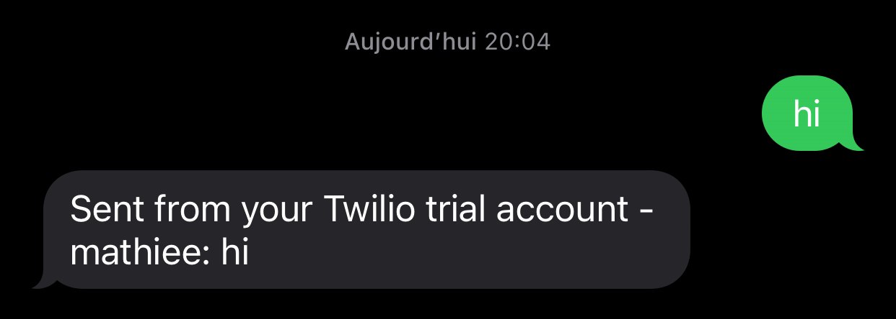

# This is a Discord Selfbot, whatever happens to your account is not my responsibility, use it at your own risk or convert it to an actual bot.

## Things needed to work

A Discord Authentication Token
A Twilio Account SID and Authentication Token ( Trial accounts work )
A weatherapi.com API Key
An api-ninja API Key

## Sources that may help you set this up while my lazyness to make a proper readme goes away

[Twilio webhooks](https://www.twilio.com/docs/usage/webhooks/getting-started-twilio-webhooks)
